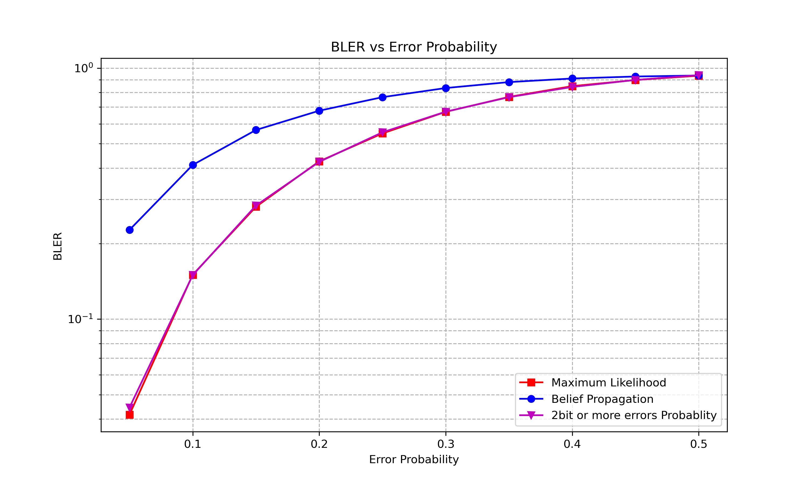
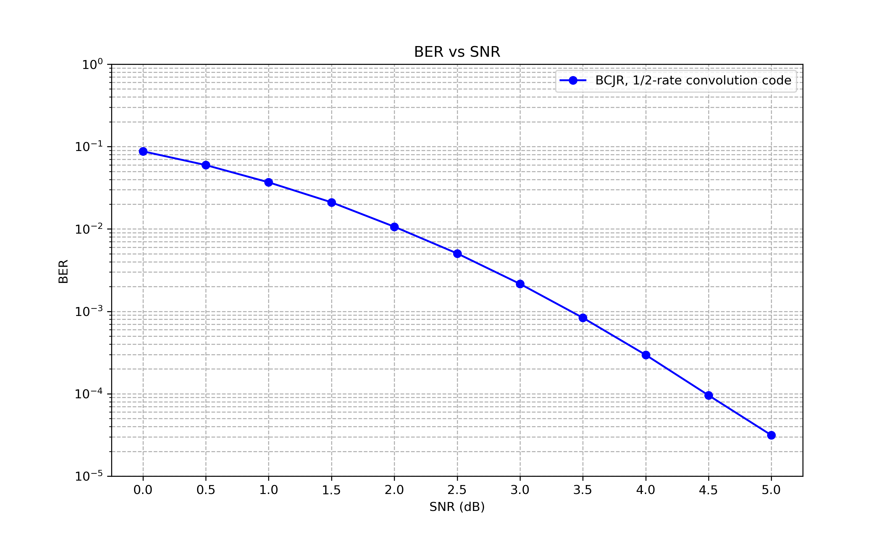

### How to install
1. python 3.7
```sh
conda create -n InformationTheory_24_spring_project python=3.7.15
activate InformationTheory_24_spring_project
conda install pytorch==1.10.1 torchvision==0.11.2 torchaudio==0.10.1 cudatoolkit=11.3 -c pytorch -c conda-forge
conda install matplotlib
conda install seaborn
```

# huffman tree result
## (7,4) hamming코드, ML과 BP 비교 (1만회 송신)


## 1/2 convolution 코드, BCJR decoding (10만회 송신, 64 정보 비트, state 초기화 3비트, state 수 8,memory 3개)
